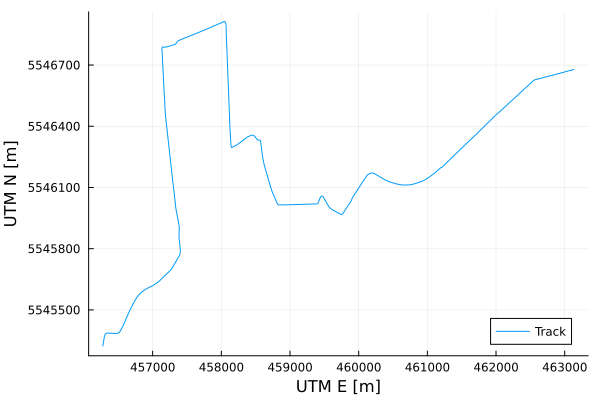
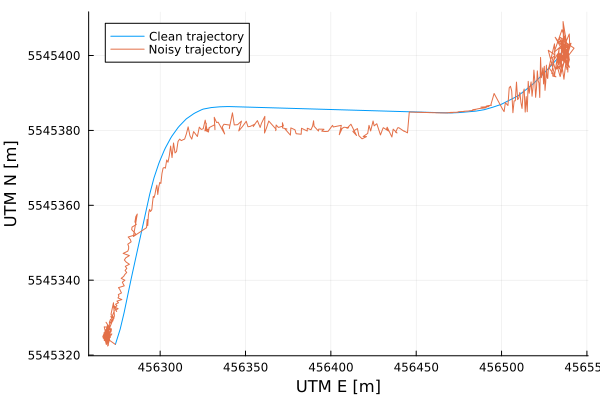
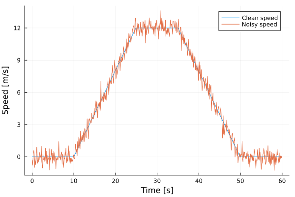
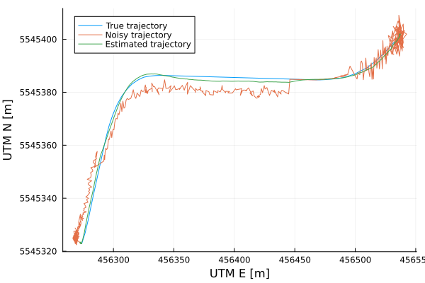
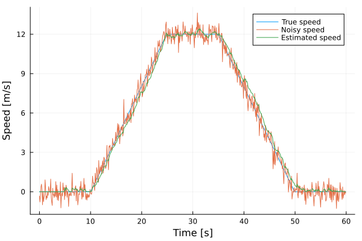

# Soft-Constrained Kalman Filter
This tutorial describes a way to introduce soft constraints into an iterated
Kalman filter scheme. 
The code is written in the [Julia](https://julialang.org/) programming language and
shows the application of soft constraints on the example of tram localization.

## Environment Setup
After downloading the repository, start a terminal in the repo's root directory
and start Julia. Afterwards, type
```julia
using Pkg
Pkg.instantiate()
```
This will install all the packages needed for this tutorial.

## Data Preparation
### Track Loading
Since the motion of a tram is inherently restricted to the tramway tracks,
it makes sense for a multi-dimensional Kalman filter to acknowledge this fact.
For the purpose of this tutorial, we will generate artificial tram trajectory along
the track of line 7 in Prague. The waypoints of the track are saved in a JLD [file](tracks/prague_line7.jld).
The track can be loaded with
```julia
using JLD
track = JLD.load("tracks/prague_line7.jld")["track"]
```
Afterwards, let's construct a [k-d tree](https://www.wikiwand.com/en/K-d_tree) for
fast look-up of nearest waypoints with the help of the `NearestNeighbors.jl` package.
```julia
using NearestNeighbors
tracktree = KDTree(track)
```
The track is a matrix of waypoints arranged in the columns. We plot the track
with the `Plots` package.
```julia
using Plots
plot(track[1,:], track[2,:], label="Track", xlabel="UTM E [m]", ylabel="UTM N [m]")
```


### Trajectory Generation
Let's generate a trajectory of our virtual tram. First, we set a sampling period to
$0.1~\text{s}$ and form a simple stop-accelerate-hold-brake-stop speed profile. We obtain the distance (along the track) by cumulative sum of the speed (multiplied by the sampling time).
```julia
sampling_period = 0.1

time = collect(range(start=0., step=sampling_period, length=length(speed)))

speed = vcat(
    repeat([0.], 100),
    range(start=0., stop=12., length=150),
    repeat([12.], 100),
    range(start=12., stop=0., length=150),
    repeat([0.], 100)
)

distance = cumsum(speed) * sampling_period
```

To transform the longitudinal coordinates to 2D UTM, we need to take one extra step.
First, we find a linear interpolation of the X and Y coordinates as a function
of the longitudinal distance between the waypoints. For this purpose, we can readily
use the `BasicInterpolators` package.
```julia
using BasicInterpolators

track_length = sum(diff(track, dims=2).^2, dims=1) .|> sqrt |> vec |> cumsum
track_length = [0.; track_length] # prepend starting zero
itpx = LinearInterpolator(track_length, track[1,:]) # X coordinate interpolation
itpy = LinearInterpolator(track_length, track[2,:]) # Y coordinate interpolation
```
The `itpx` and `itpy` objects are functions of the distance along the track. As
every function in Julia, we can apply scalar function to every element of a vector
using the dot notation. Here, we find the interpolated XY coordinates of the
generated trajectory.
```julia
x = itpx.(distance)
y = itpy.(distance)
```

### Noise Generation
To simulate different conditions of GNSS signal reception, the generated
data are superimposed with noise.
```julia
x_noisy = copy(x)
x_noisy[50:200] -= 5. .+ randn(151)
x_noisy[250:400] -= 5. .+ randn(151)
x_noisy[450:550] += 2. * randn(101)
y_noisy = copy(y)
y_noisy[50:150] += 2. .+ randn(101)
y_noisy[200:350] -= 5. .+ randn(151)
y_noisy[400:550] += 3. * randn(151)

speed_noisy = speed .+ 0.5 * randn(length(speed))
```
We can see comparison between the clean data and the data with noise.





## Iterated Kalman Filter Setup
Before the estimation, we need to set up the Kalman filter.
For the estimation purposes, we will use the constant velocity model (CVM) which
is characterized by the transition function of the form (for 1D)
$$ \mathbf{x}_{k+1} = \begin{bmatrix} 1 & T_s \\ 0 & 1 \end{bmatrix} \mathbf{x}_k + \mathbf{w}_k,$$
where $\mathbf{x}_k$ is the state vector at time $k$ and $\mathbf{w}_k$ is the process
noise at time $k$. 

Let's specify the process noise covariance matrix and the transition (state) function.
```julia
using BlockDiagonals, ExtendedFiltering

Σ_process = 1e-2 * diagm([1., 1., 1., 1.])  

transition_matrix_1D = [1. sampling_period; 0. 1.]
transition_matrix_2D = BlockDiagonal([transition_matrix_1D, transition_matrix_1D])
state_function(x̂::StateEstimate) = transition_matrix_2D * x̂.x̂
∇state_function(x̂::StateEstimate) = transition_matrix_2D'
state_equation = StateEquation(state_function, ∇state_function, Σ_process)
```
The transition matrix is formed from two 1D CVM systems with `BlockDiagonals` package.
The derivative of the transition function is also specified and saved in the
custom structure `StateEquation` which is defined in the `ExtendedFiltering` package
of this repository.

Beside the transition equation, we also have the output equation for describing
the measured quantities of the system.
$$ \mathbf{z}_k = \mathbf{g}(\mathbf{x}_k) + \mathbf{v}_k, $$
where $\mathbf{z}_k$ is the measurement vector, $\mathbf{g}$ is the output function and
$\mathbf{v}_k$ is the measurement noise. 

The setup of the output equation is similar to the transition equation, the measured quantities are X coordinate, Y coordinate and velocity magnitude (speed):
```julia
Σ_measurement = diagm([3., 3., 1.])

output_function_GNSS(x̂::StateEstimate) = [x̂.x̂[1]; x̂.x̂[3]; norm(x̂.x̂[[2,4]])]
function ∇output_function_GNSS(x̂::StateEstimate)
    denom = max(norm(x̂.x̂[[2,4]]), 1e-2) # to avoid division by near-zero
    return [
        1. 0. 0. 0.;
        0. 0. 1. 0.;
        0. x̂.x̂[2] / denom 0. x̂.x̂[4] / denom
    ]
end
```

### Soft Constraint
To soft-constrain the state estimate, a pseudo-measurement is generated from
a non-existent sensor and treated as if it was a reading from a real sensor.
Let's now create a position soft constraint to limit the estimate
to the vicinity of the tramway tracks. 

The procedure is following: 

1. Find waypoints of the track in the vicinity of the
    current position estimate.

2. Treat each of the found waypoints as a mean of a 2D normal distribution
with a set covariance. Add all the `waypoint distributions' together to
form a Gaussian mixture.

3. Approximate the Gaussian mixture with a single normal distribution with the
same mean and covariance.

4. Treat the resulting 2D distribution as a position sensor reading and incorporate
it into the estimation process.

We need to define covariance of the individual waypoints and output function
of the pseudo-measurement.
```julia
Σ_trackpoint = diagm([1., 1.])

output_function_track(x̂::StateEstimate) = [x̂.x̂[1], x̂.x̂[3]]
∇output_function_track(x̂::StateEstimate) = [1. 0. 0. 0.; 0. 0. 1. 0.]
```

## Estimation Loop
All that remains is to perform the estimation itself. The estimate is initialized
with unit matrix covariance, zero speed and the initial measured positions (again, the `StateEstimate` structure is defined in the `ExtendedFiltering` package).
```julia
sate_est = StateEstimate(
    [x_noisy[1], 0., y_noisy[1], 0.],
    diagm([1., 1., 1., 1.])
)
```
Let's pre-allocate lists to save the estimates and measurements.
```julia
state_estimates = Vector{StateEstimate}(undef, length(time))
GNSS_measurements = Vector{MeasurementSource}(undef, length(time))
track_pseudomeas = Vector{MeasurementSource}(undef, length(time))
```

And now for the core of the tutorial. In the estimation loop,
we first perform the filtering (data update) step by taking the
GNSS measurement and the soft constraint pseudo-measurement and applying
the Gauss-Newton-like data update with step size control (see the accompanying article for details). After that, the state estimate and the measurements are saved
and the usual linear Kalman filter prediction (time update) step is done.
```julia
for (k, t) in enumerate(time)
    # Filtering step
    z_GNSS = [x_noisy[k], y_noisy[k], speed_noisy[k]]
    GNSS_meas = MeasurementSource(z_GNSS, Σ_measurement,
        output_function_GNSS, ∇output_function_GNSS)

    z_track, Σ_track = get_track_constraint(state_est, tracktree, track,
        point_covariance=Σ_trackpoint)
    track_meas = MeasurementSource(z_track, Σ_track,
        output_function_track, ∇output_function_track)

    global state_est = data_update_iekf_gn_stepcontrol(state_est, [GNSS_meas, track_meas])

    # Save the state estimate
    state_estimates[k] = state_est
    GNSS_measurements[k] = GNSS_meas
    track_pseudomeas[k] = track_meas

    # Prediction step
    state_est = prediction_kf(state_est, state_equation)
end
```

## Result
Finally, we can inspect the results of our estimation.
```julia
x_pred = [x̂.x̂[1] for x̂ in state_estimates]
vx_pred = [x̂.x̂[2] for x̂ in state_estimates]
y_pred = [x̂.x̂[3] for x̂ in state_estimates]
vy_pred = [x̂.x̂[4] for x̂ in state_estimates]
speed_pred = [norm([vx, vy]) for (vx, vy) in zip(vx_pred, vy_pred)]
```
After extracting the quantities, we can plot the position and speed estimates.
```julia
plot(x, y, label="True trajectory", xlabel="UTM E [m]", ylabel="UTM N [m]")
plot!(x_noisy, y_noisy, label="Noisy trajectory")
plot!(x_pred, y_pred, label="Estimated trajectory")

plot(time, speed, label="True speed", xlabel="Time [s]", ylabel="Speed [m/s]")
plot!(time, speed_noisy, label="Noisy speed")
plot!(time, speed_pred, label="Estimated speed")
```




If we import the `StatsPlots` package, we can even generate a GIF to better see the estimation process!


The whole code is contained in the [Julia script](./soft_constraint_example.jl).